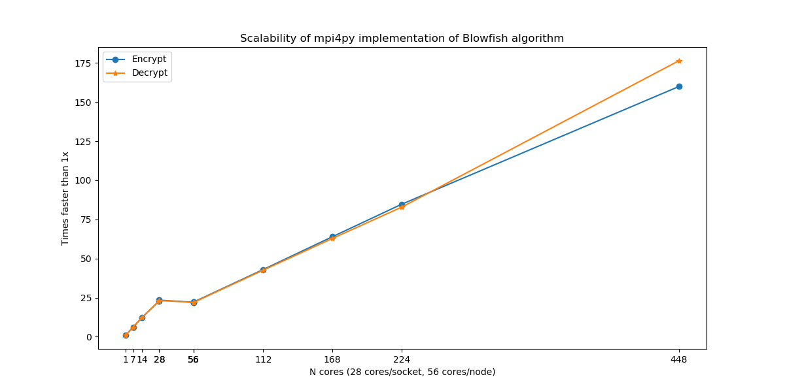

# Week 9: OpenMPI Programming and Benchmarking
* Blowfish (cipher)
* Mpi4py

## [Blowfish](https://en.wikipedia.org/wiki/Blowfish_(cipher))

Blowfish is a symmetric-key block cipher, designed in 1993 by Bruce Schneier and included in many cipher suites and encryption products.   

Many implementations of this algorithm can be found [HERE](https://www.schneier.com/academic/blowfish/download.html).  

To understand the algorithm, a python version from Michael Gilfix were used in this example. [Github](https://gist.github.com/eigenein/a56ce4d572484a582e14).  

## [MPI for Python](https://mpi4py.readthedocs.io/en/stable/index.html)

MPI for Python provides bindings of the Message Passing Interface (MPI) standard for the Python programming language, 
allowing any Python program to exploit multiple processors and also multiple nodes.
 
Install mpi4py
 
    conda install -y mpi4py

Implementation

[blowfish.py](blowfish_py/blowfish.py)  
[blowfish_single_core.py](blowfish_py/blowfish_single_core.py)  
[blowfish_mpi.py](blowfish_py/blowfish_mpi.py)  
[plot.py](blowfish_py/plot.py)

Submit mpi4py jobs (A sample SLURM script)

    #!/bin/bash
    #SBATCH --job-name=MPI
    #SBATCH --partition=256GBv1
    #SBATCH --nodes=8             # number of nodes requested by user
    #SBATCH --ntasks-per-node=56  # number of tasks per node
    #SBATCH --time=0-01:00:00     # run time, format: D-H:M:S (max wallclock time)
    #SBATCH --output=N.448.%j.out # redirect both standard output and erro output to the same file
    
    # load module
    module load python/3.7.x-anaconda
    
    # start the virtual environment
    source activate py3
    
    echo "SLURM_NTASKS: $SLURM_NTASKS"
    # run mpi4py jobs
    mpirun -np $SLURM_NTASKS python blowfish_mpi.py

Results

    